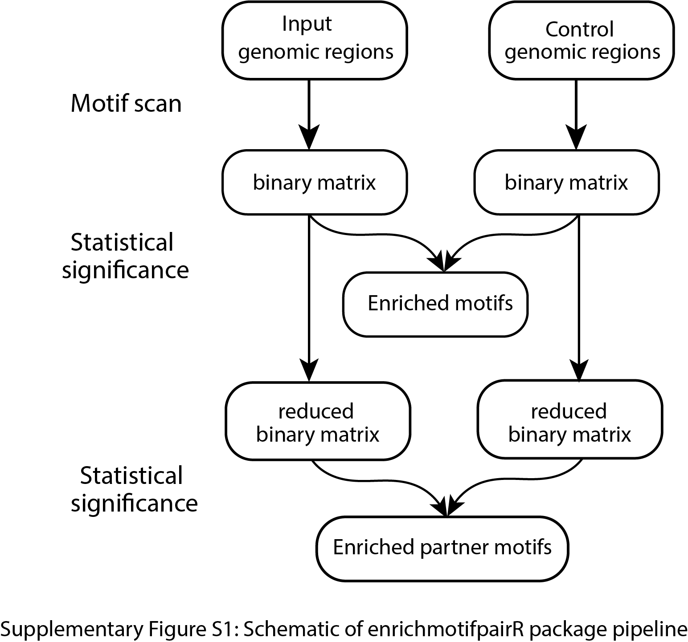

README
================

## Introduction

The identification and differential enrichment of transcription factor
(TF) motifs in a given set of genomic regions relative to control
regions is a common task in regulatory genomics. Here, we present
enrichmotifpairR, an R package for identification of differentially
enriched TF motifs and their binding partner motifs, or enriched motif
pairs, in a given set of genomic regions relative to a control set of
genomic regions.



## Installation

First install the dependency packages.

``` r
# install devtools and biocmanager if necessary
if (!requireNamespace("BiocManager", quietly = TRUE))
    install.packages(c("BiocManager", "devtools"))

# other dependency packages
BiocManager::install(c("GenomicRanges", "SummarizedExperiment", "motifmatchr", 
                       "BiocGenerics", "Biostrings", "GenomeInfoDb", "IRanges",
                       "TFBSTools", "S4Vectors", "GO.db"))

# genome annotations
BiocManager::install(c("BSgenome.Hsapiens.UCSC.hg19", "BSgenome.Hsapiens.UCSC.hg38")


```

Next install the `enrichmotifpairR` package

``` r
# installation
devtools::install_github("nashchem/enrichmotifpairR")

# load
library(enrichmotifpairR)
```

## Use case examples

See the `vignettes` directory for several use case examples.


## Shiny app
Web-based interactive shiny app is also available at [shiny app](https://hawkinslab.shinyapps.io/EnrichMotifPair/).


